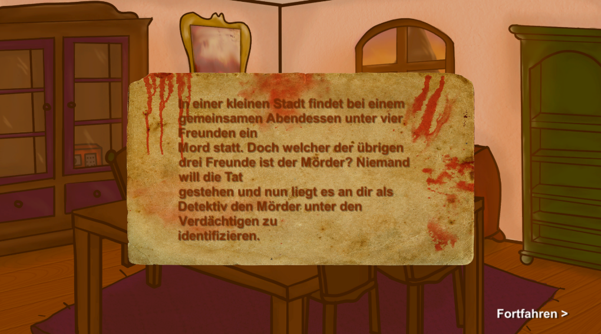

### Project description:

* In this project I created a Point and Click game. My theme is a detective/ thriller story where a group of friends had to witness murder
 within their inner circle. As player you have to find the murder with examination and the help of hints by combinating certain objects.
Furthermore it can be mentioned that all the main assets (scenery, characters, items,...) are drawn digitally by myself.

### Development platform:

* Windows 10
* Unity 2019.1.14f1

### Target platform:

* 2D WebGL (1080 x 1920)

### Visuals:

### Necessary setup/execution steps: 

* https://4ahmnm2021-mtin-g2.github.io/point-and-click-Maringer_Nina/

### Third party material:

* https://github.com/4ahmnm2021-MTIN-G2/point-and-click-template

### Project state:

* 100 %

### Limitations: 

* none

### Lessons Learned:

* further C# functions:

	* condtions
	* combination of different objects
	* interactable objects
	* movement of player in 2D environment
	

Copyright by Nina Maringer
